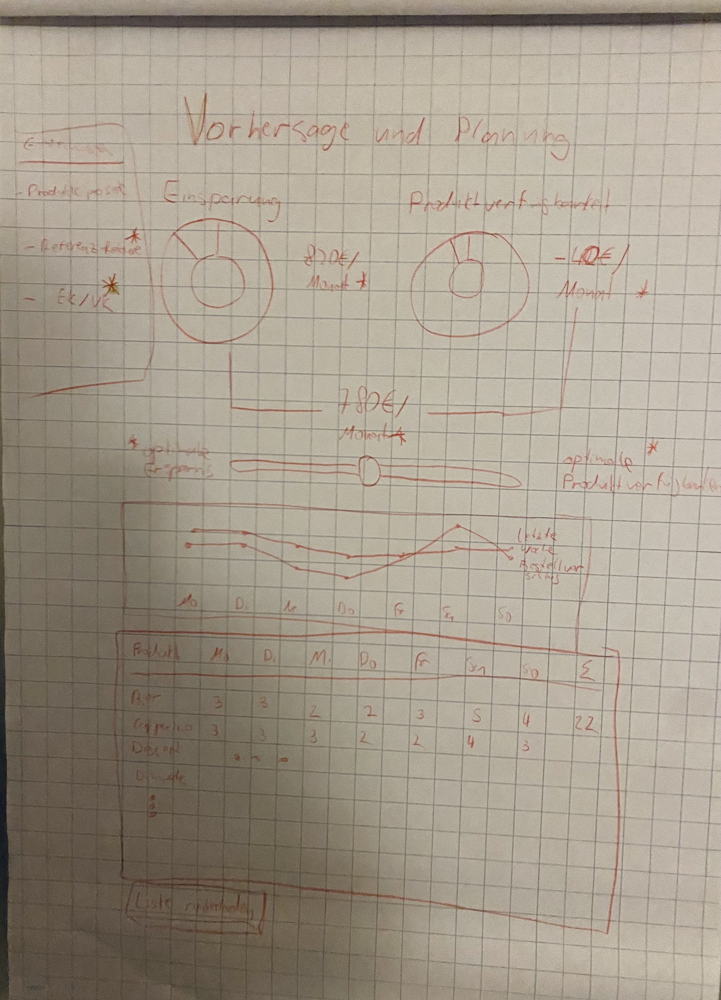
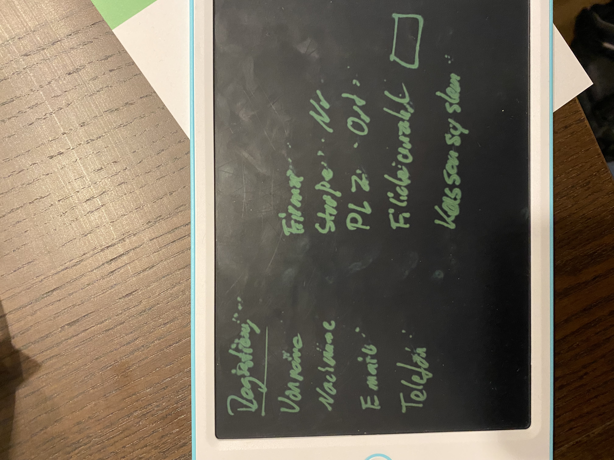

## Introduction

I have started a new page 'dashboard.svelte' that's supposed to become the new start/main-page of the  app - please complete it and replace index.svelte. All pages except signup should only be visible to logged-in users. Here's a drawing how it should look like:

- on top are two donut-charts "Einsparung" and "Produktverfügbarkeit"
- each has two segments green and orange
- "Einsparung" shows how much money a bakery can save per month
- "Produktverfügbarkeit" shows how much money a bakery might loose due to not enough product on the shelf
- centered below them a total number "Einsparung" - "Produktverfügbarkeit"
- below that an element that allows users to choose between 5 plans: XS, S, M, L, XL
   - I thought a slider but the SMUI-slider "misbehaves", maybe 5 segmented buttons are better: https://sveltematerialui.com/demo/segmented-button/
- below a line-diagram that shows "letzte Woche" vs. "Bestellvorschlag"
- below the table that shows per product and per day the order proposal, and a weekly total at the end
- below a button "Liste runterladen"
- missing are two data-entry-elements that allow the user to enter
  - "Referenz-Retoure": "Der durchschnittliche Warenwert der Produkte, die pro Tag nicht verkauft werden und daher 'weg' müssen"
  - "EK/VK": "Der durchschnittliche Anteil des Einkaufspreises am Verkaufspreis"

## Interactions

- There's a functional prototype "Dashboard_Prototyp.xlsx" in the repository
- When the user chooses a different plan, all elements on the dashboard need to change
- When the user changes "Referenz-Retoure" or "EK/VK" they need to be changed in the usersettings and sent to /api/usersettings as 
<code>
    , 'returns_current': 250
    , 'sales_price_cost_share': 0.3
</code>
- We need a method to give helper-texts to users. Think Hover-effect for Desktop and click-to-show for mobile/tablet. A text for each Donut, for the Total Number below, the XS-XL-Buttons, The line-diagram, "Referenz-Retoure" and "EK/VK"

## Signup-page
- build a 2-column-layout:

- after a successful signup show a page "Die Registrierung war erfolgreich, wir melden uns in Kürze bei Ihnen!". (Not just a message)
- For "Kassensystem" make a dropdown with 3 values: "ready2order", "helloCash", "Anderes..", if "Anderes" allow manual entry

## Other changes
- You proposed a refactoring of the table 3 months ago - I think that still makes sense? Let's roll into this sprint
- remove the "Vorhersage und Planung" section from the settings-page
- Increase Top-App-Bar height by 50%
- There's a strange bug on mobile, a teammate reported he had id on an iPad on Safari, I can only reproduce in on chrome: When entering the register-form, in certain cases, the Top-App-Bar becomes invisible. Please see strange_bug.mp4

## Backend
- This is the url of the new dev-backend: https://foodsight-backend-b3grh.ondigitalocean.app/docs
- In the repo is an example-response, <code>response_example.json</code>
  - please amend what you like different / helps you.
