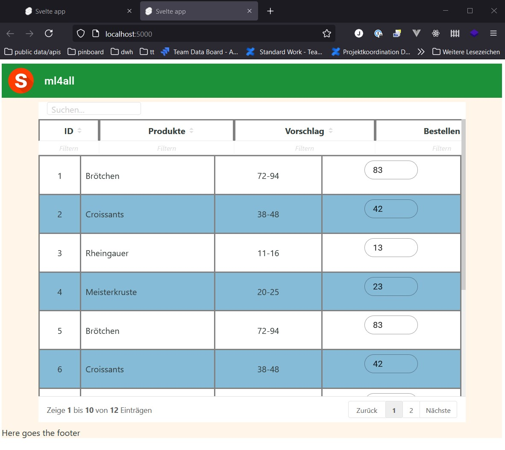
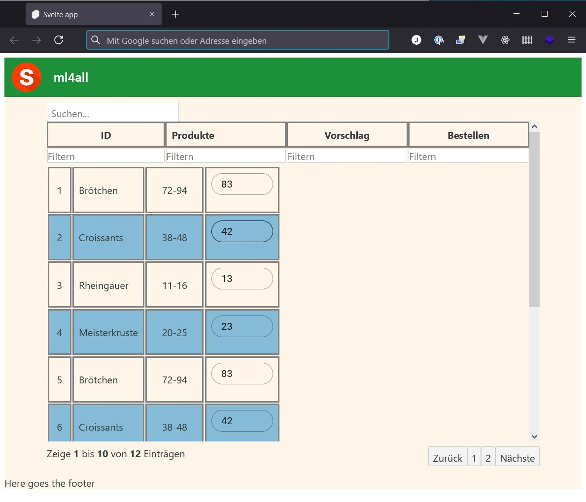

# ml4all frontend

This is the frontend for a service that helps reduce foodwaste by producing accurate sales-forecasts

It is built using 
- https://svelte.dev/
- https://github.com/vincjo/svelte-simple-datatables
- https://sveltematerialui.com/

*Note that you will need to have [Node.js](https://nodejs.org) installed.*


## Get started

Install the dependencies...

```bash
cd ml4all-frontend
npm install
```

...then start [Rollup](https://rollupjs.org):

```bash
npm run dev
```

Navigate to [localhost:5000](http://localhost:5000). You should see your app running. Edit a component file in `src`, save it, and reload the page to see your changes.

By default, the server will only respond to requests from localhost. To allow connections from other computers, edit the `sirv` commands in package.json to include the option `--host 0.0.0.0`.

If you're using [Visual Studio Code](https://code.visualstudio.com/) we recommend installing the official extension [Svelte for VS Code](https://marketplace.visualstudio.com/items?itemName=svelte.svelte-vscode). If you are using other editors you may need to install a plugin in order to get syntax highlighting and intellisense.
\
&nbsp;
\
&nbsp;
\
&nbsp;

## Layout & Design challenge

- The thick borders around the table are only there for easier "debugging" - ignore or feel free to remove

### Problems
- The column-headers don't align with the column-widths, they need to be aligned in any resolution
- The data-table design is far off from the general app-design. This looks not good

    - This is because it is styled using it's own "css-magic"
    - This can be switched off using line 47 in Foodtable.svelte (try it out)

    - Now the columns don't align at all any more with the column-headers
    - ...but the design follows the general look and feel

## What you can do for me
- Create a concise layout especially for the data-table, ideally for the whole app
- Solve above mentioned problems
- The layout should work well on Tablets, Smartphones, Screens (in order of importance)
- Bonus 1: Make it look nice :) Target audience are bakers, restaurants, in general people who work with food and care for the environment
- Bonus 2: Give a humble developer with basic frontend-knowledge a simple 1-2-3 guide how to handle layout/design for the app
